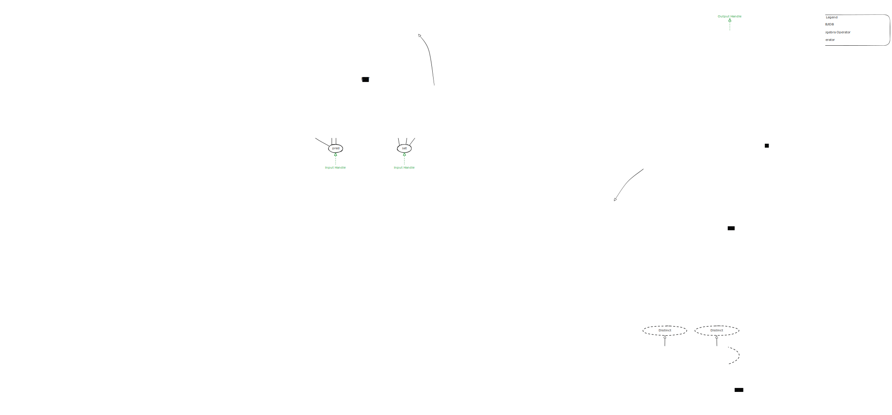

# Datalog to Relational Algebra



## Parsing Datalog

### Grammar

```ebnf
program     = rule* EOF ;
rule        = head ":-" body "." ;
head        = "distinct"? IDENTIFIER "(" field ( "," field )* ")" ;
field       = IDENTIFIER ( "=" comparison )? ;
body        = ( atom ( "," atom )* )? ;
atom        = ( "not"? predicate ) | comparison ;
predicate   = IDENTIFIER "(" variable ( "," variable )* ")" ;
variable    = IDENTIFIER ( "=" IDENTIFIER )? ;

comparison  = term ( ( "==" | "!=" | ">" | ">=" | "<" | "<=" ) term )? ;
term        = factor ( ( "+" | "-" ) factor )* ;
factor      = unary ( ( "*" | "/" ) unary )* ;
unary       = ( "-" | "!" ) unary | primary ;
primary     = literal | IDENTIFIER | "(" comparison ")" ;
literal     = BOOL | UINT | IINT | STRING | NULL ;

BOOL        = "true" | "false" ;
UINT        = DIGIT+ ;
IINT        = ( "-" | "+" )? DIGIT+ ;
STRING      = "\""<any char except "\"">*"\"" ;
IDENTIFIER  = ALPHA ( ALPHA | DIGIT )* ;
ALPHA       = "a".."z" | "A".."Z" | "_" ;
DIGIT       = "0".."9" ;
NULL        = "null" ;
```

### Choice of Parsing Framework

In Rust land there are two well-known crates: [nom] and [pest]. Both take very
different approaches to parsing. [nom] is a parser combinator framework. [pest]
is a parser generator working on top of PEG grammars. [nom vs pest] gives a good
overview of the differences.

The missing compile-time checks for the conversion from pest's API to the target
types are a major downside. Hence, we decided to use [nom].

## Evaluation Order via Dependency Graph

> The dependency graph is also called _precedence graph_ but it has the
> directions of the edges reversed (hence "precedence" instead of "dependency").
> Its definition can be found in [the literature][dlog_survey].

The dependency graph can also be useful to reject invalid programs, that is,
programs not adhering to stratified negation or mutually recursive rules.

To us, a Datalog program is valid, iff

1. **Range Restriction.**. Every variable occuring in the head of a rule must
   also occur in the body of that rule.
1. **Safety Condition.** Every variable occuring in the body of a rule must
   appear in at least one positive (non-negated) atom in the body.
1. **Recursion Limitation.** The dependency graph is acyclic (except for
   self-loops).

Without (2), the results of the query may not be finite anymore, and the results
would not depend on only the actual contents of the database anymore, thereby
violating the notion of _domain independence_.

Note that (3) this is a sufficient condition for stratified negation, too,
because it is more restrictive than the definition of stratified negation:
Stratified negation does allow cycles in the dependency graph, but only if they
do not contain a negation on their path.

## Mapping to IR of Relational Algebra Operators

Datalog works through binding values to variables but the IR works in terms of
relations. How to translate between the two representations?

## Query Optimization

Start from Cartesian product with subsequent filters and employ predicate
pushdown and equi joins wherever applicable.

[dlog_survey]:
  https://dl.acm.org/doi/10.1561/1900000017
  "Datalog and Recursive Query Processing - Green"
[nom]: https://crates.io/crates/nom "Nom - Parser combinator framework for Rust"
[pest]: https://crates.io/crates/pest "Pest - The Elegant Parser"
[nom vs pest]:
  https://www.synacktiv.com/en/publications/battle-of-the-parsers-peg-vs-combinators
  "BATTLE OF THE PARSERS: PEG VS COMBINATORS"
